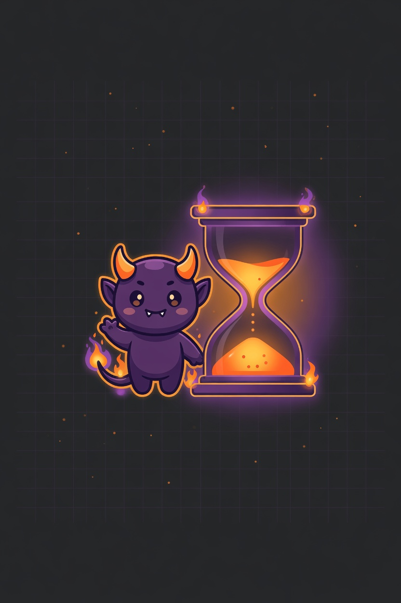

<p align="center">
  
</p>

# DeadlineDemon

[](https://www.npmjs.com/package/deadline-demon)

Cross-CLI hook tool that arms session deadlines and nudges AI agents to finish on time.

Works with **Codex CLI**, **Grok Build**, and **Claude Code**.

## Getting started

### Codex plugin install

Install DeadlineDemon as a native Codex plugin from this GitHub repo:

```bash
codex plugin marketplace add bengHak/DeadlineDemon
codex plugin add deadline-demon@deadline-demon
codex
```

Open `/hooks`, review and trust the DeadlineDemon lifecycle hooks, and start a new thread.

The Codex plugin runs local Node.js hooks from the installed repo, so `node` must be available on the non-interactive shell PATH.

### Grok, Claude, and local install

Install hooks with **npx** (no clone or global install required):

```bash
npx deadline-demon install
```

Hooks are copied to a persistent directory (`~/.deadline-demon/`) and wired into Grok, Codex legacy local plugins, and Claude Code. Re-run `install` after upgrading the package.

Enable the plugin or hooks in your harness (`/plugins`, `/hooks` in Codex/Grok; trust project hooks if using repo-local copies).

## Two arm commands

One install provides both modes — pick per session when you arm:

| Mode | Arm command | Behavior |
|------|-------------|----------|
| **Nudge** (default) | `/deadline 8 "task"` | Countdown context each turn; tool calls are **not** blocked |
| **Hard** | `/deadline-hard 8 "task"` | Same countdown; after time-up, non-wrap-up tool calls are blocked (git status/diff/add/commit still allowed) |

Examples:

```
/deadline 8 "login page"
/deadline 5 refactor auth
/deadline-hard 10 "ship hotfix"
```

The number is **minutes only** from 1 to 1440 (no `m`, `분`, or other unit suffix). Task text is shortened in hook output when it is very long.

## Commands

```bash
npx deadline-demon install [--dry-run]
npx deadline-demon status [--session-id <id>]
npx deadline-demon reset [--session-id <id>]
```

- **status** — show armed sessions, remaining time, and mode (`nudge` or `hard`)
- **reset** — clear one session or all armed sessions

## Grok note

If Grok ignores `UserPromptSubmit` stdout, nudge text may not appear. Tool blocking applies only to sessions armed with `/deadline-hard` (the `PreToolUse` hook is installed but allows all tools for `/deadline` sessions).

---

## Development

### Build and install from source

```bash
git clone git@github.com:bengHak/DeadlineDemon.git
cd DeadlineDemon
npm install
npm run build
npx deadline-demon install
```

### Install targets

| Harness | Path |
|---------|------|
| Codex native plugin | `.codex-plugin/plugin.json` → `hooks/hooks.json` → `dist/cli.js` |
| Persistent package | `~/.deadline-demon/` |
| Grok | `~/.grok/plugins/deadline-demon/` |
| Codex | `~/.codex/plugins/deadline-demon/` |
| Claude | `~/.claude/hooks/deadline-demon.json` → `~/.deadline-demon/dist/cli.js` |

### Test

```bash
npm test
```

### How it differs from timer hooks

Existing Claude timer hooks **report elapsed time**. DeadlineDemon **reminds the agent of a deadline**:

- `/deadline N` arms a nudge-only session timer
- `/deadline-hard N` arms the same timer with tool-call enforcement after time-up
- Every prompt injects remaining time with escalating urgency

## License

MIT
